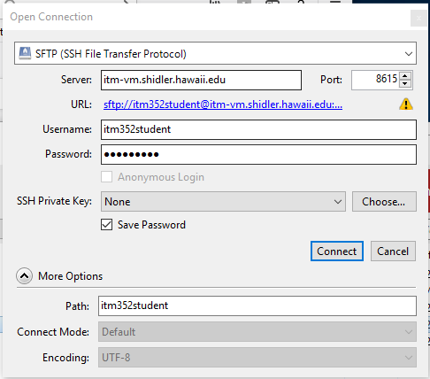

# Local vs Global web servers
There really is no difference between the web server such as one you might install on your laptop for class and any other web server on the internet. It's really a matter of accessibility. A local web server is accessed though the URL http://localhost where localhost is always set to the IP address 10.0.0.1 (which is also known as the "local loopback"). Anytime you try to connect to localhost you will always be connecting to your own machine. So if you set your web server's address to be localhost it then can only be accessed from your machine regardless if it is connected to the internet (or any network). A global web server simply has it's address set to some globally accessible IP address (and possibly an internet registered domain name).

You should always develop your web applications locally and then "publish" them after careful testing to a global web server (that is if you want the outside world to be able to access it). For our class we have made available to you the global web server http://itm-vm.shidler.hawaii.edu/itm352 and this is where you should test all your applications if they are intended to be used non-locally.

# Lets take a look at XAMPP and test it as your local Web server

Create a plain textfile using VS Code or your favorite text editor (notepad, FrontPage, etc.) and create a new webpage.

  1. Save the file to your XAMPP htdocs directory (for example on the mac it may be /Applications/XAMPP/xamppfiles/htdocs) and call it: `<your first name>_hello.htm`. NOTE: On the mac you may need to set the permissions on the htdocs directory to read/write for all. 

  2. Type in “an HTML hello from <YOUR NAME>!

  3. In your browser, directly access the using the URL `file:<XAMPP htdocs>/<your first name>_hello.htm` For example, `file://Applications/XAMPP/xamppfiles/htdocs/Port_hello.htm`  NOTE: The htdocs path will look different on the PC

  4. Now access the file through your local web server typing in `http://localhost/<your name>_hello.htm`
  
  
# Testing the class web server as your global Web server

Locate the html file you created to test your local web server 

  1. Use SFTP or SSH or a file transfer tool such as [CyberDuck](https://cyberduck.io/?l=en) to upload it to the ITM 352 student class webserver at itm-vm.shidler.hawaii.edu/itm352student/<your class section>. The "htdocs" folder to store your web files is actually called public_html, but when you log in it will take you directly to this location so you won't see it. You cannot write file to this directory so you will need to go to Port_section1 or Kazman_section2 depending on which class section you are in. Make a note of this as you will need to add this to URL to access your file.
    
   - username is itm352student with password *(instructor will tell you in class)* you **must** use port 8615  (sftp://itm352student@itm-vm.shidler.hawaii.edu:8615/)

   See [http://www.hawaii.edu/askus/692](http://www.hawaii.edu/askus/692) for more information on SSH/sFTP 
   
  2. Access your web page by typing in `http://itm-vm.shidler.hawaii.edu/itm352student/<your class section>/<your name>_hello.htm` For example `http://itm-vm.shidler.hawaii.edu/itm352student/Port_Section1/Port_hello.htm`
   
  
  If you are using Cyberduck here is what your open connection should look like this:
  
  
